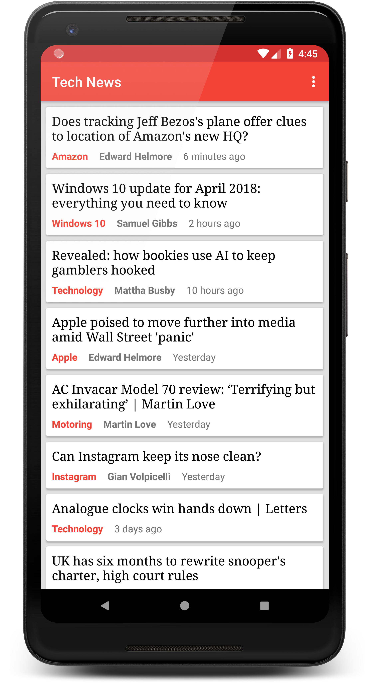
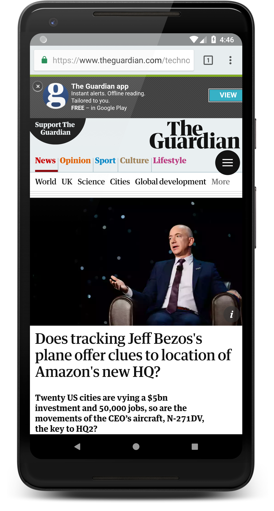

# News App

**Platform: Android (Min SDK: 19, Target SDK: 27)**

**Author: [Timotius Oktorio](https://ca.linkedin.com/in/timotiusoktorio "LinkedIn Profile") (toktorio@gmail.com)**

Simple news app that fetches data from [theguardian](http://open-platform.theguardian.com/documentation/) news open source API.

*This app is created as the eighth project of [Android Basics Nanodegree](https://www.udacity.com/course/android-basics-nanodegree-by-google--nd803) program at Udacity.*

*This app uses the theguardian API but is not endorsed or certified by theguardian.*

### Features
- Get the latest technology news directly from theguardian news.
- Simple and stunning design that follows the Material design guidelines.

### What I have learned from this project
- Fetching data from an API using Android HttpURLConnection API.
- Using AsyncTaskLoader to load data efficiently in the background thread.
- Parsing a JSON response to get the required data for the model class.
- Creating a RecyclerView that contains the data and display it to the user.
- Handling error case and empty response gracefully.

  

Get the apk file [here](https://github.com/toktorio/News-App/blob/master/app/release/news-app.apk?raw=true) to install the app on your device. Note that depending on your device settings, you might need to allow installation from unknown sources in order to install this app. Visit this [link](https://www.androidcentral.com/unknown-sources) for the detailed instructions.